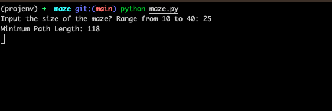
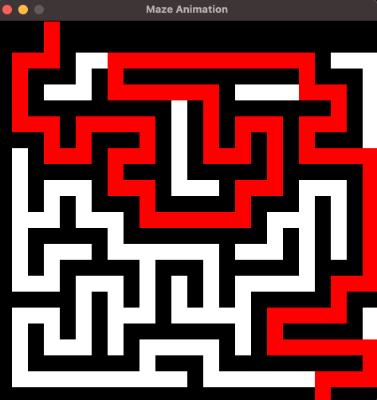

# Finding the Shortest Path in a Maze using Backtracking

This repository presents a backtracking algorithm for finding the shortest path across a maze. The project's goal is to assist users in efficiently solving maze problems by using the power of recursive backtracking algorithms. The algorithm navigates the maze in the shortest amount of steps possible using a basic yet effective strategy.

## Features

* Solves maze puzzles of varying sizes and complexities
* Utilizes backtracking to explore and backtrack through different paths
* Finds the shortest path from the starting point to the destination
* Provides visualization to track the algorithm's progress through the maze
* Generate random maze with customized sizes

This project is a great learning resource for understanding backtracking algorithm and their application in maze-solving.

## Usage

To use this project, run the following in the terminal `python3 maze.py` , a random maze is then generated. The algorithm will then navigate through the maze, and display the shortest path from the starting point to the destination.

## Dependencies

Python 3.6 or later
pygame 2.3.0 or later

## Screenshots
[Screenshot of the terminal running the maze solver program]

[Maze solver in action]

